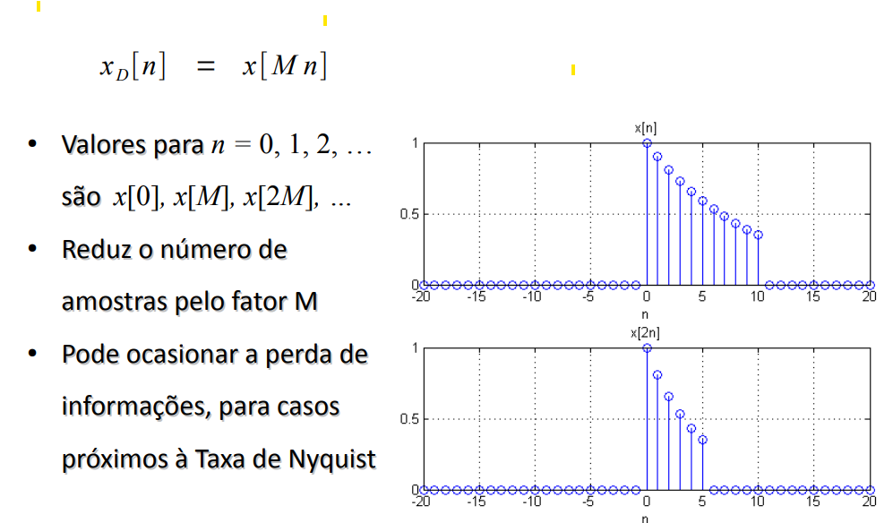
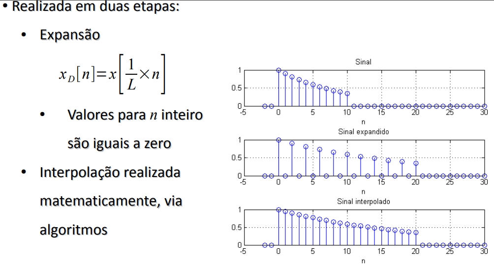

## Introdução

* sinal $x[n]$ é basicamente uma sequência de números.
* exemplos de sinais naturais: 
    * estudos populacionais
    * problemas de amortizações
    * rastreamento por radar
* a variável independente é $n$ que assume valores inteiros e $x[n]$ representa o n-ésimo número da sequência.
* Um sistema em tempo discreto processa uma sequência de números resultando em outra sequência de números.
Sinal discreto obtido por amostragem uniforme de um sinal contínuo no tempo, $x(t)$, pode ser expresso por $x(nT)$, onde T é o intervalo de amostragem. Trata-se de uma sequência de números e portanto é um sinal discreto. Pode ser representado por $x[n]$

### Tamanho de um Sinal em TD (inglês DT)

Energia

$E=\sum_{n=-\infty}^{\infty}|x[n]|^2$

Potência

$P=\frac{1}{2N+1}\sum_{n=-N}^N|x[n]|^2$, onde N é o número de amostras

[Ir para os Exercícios](./Aula_01.ipynb)

Um sinal em tempo discreto pode ser ou um sinal de energia ou um sinal de potência, mas nunca os dois ao mesmo tempo.

## Operações Úteis em TD (DT)

* Deslocamento: ($M > 0$)
    - $x_1[n] = x[n-M]$ atraso
    - $x_2[n] = x[n+M]$ avanço

* Reversão no tempo: 
    - $x_1[n] = x[-n]$ a

Exemplo

* Alteração da Taxa de Amostragem: Decimação ou Interpolação

    - $x_d[n] = x[Mn]$ - esta sequência reduz o número de amostras pelo fator M

    - Interpolação

##  Alguns modelos de Sinais em tempo discreto Importantes

* Impulso Unitário $\delta{[n]}$
* Degrau Unitário $u{[n]}$
* Exponencial  $\gamma^n$
* Senóide $cos(Ωn + Θ)$
* Exponencial Complexa $e^{jΩn }$

[Ir para os Exercícios](./Aula_02.ipynb)

