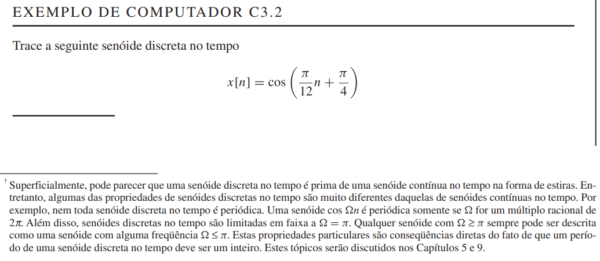
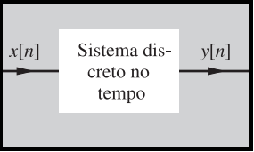
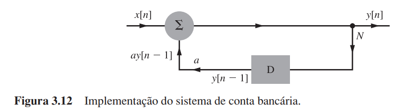
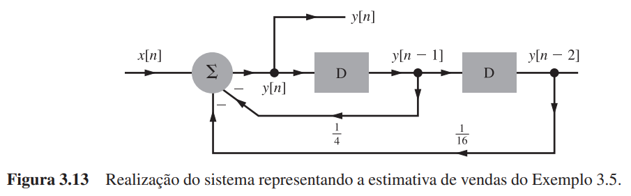
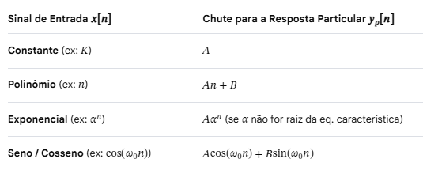

## Sinais Discretos Senoidais 

Nem sempre são periódicos

## Sistema em Tempo Discreto

### EXEMPLOS DE SISTEMAS EM TEMPO DISCRETO

#### EXEMPLO 3.4 (Conta Bancária) - Lathi

#### EXEMPLO 3.5 (Estimativa de Vendas)

### FORMAS RECURSIVA E NÃO RECURSIVA DE EQUAÇÃO DIFERENÇA
A Eq. (3.14b) $y[n] - y[n-1] = Tx[n]$

descreve a Eq. (3.14a) 
$$
y[n] = T\sum_{k=-\infty}^{\infty}x[k]  
$$
de outra forma, qual é a diferença entre estas duas formas? Qual forma é preferível? 

Para responder a estas questões, vamos examinar como a saída é calculada por cada uma destas formas. Na Eq. (3.14a), a saída y[n] em qualquer instante n é calculada somando todos os valores passados de entrada até o instante n. Isto pode significar uma grande quantidade de adições. Em contraste, a Eq. (3.14b) pode ser expressa por 

$y[n] = y[n − 1] + Tx[n]$.

Logo, a determinação de $y[n]$ envolve a adição de somente dois valores, o valor anterior da saída $y[n − 1]$ e o valor atual da entrada $x[n]$. Os cálculos são realizados recursivamente usando os valores anteriores da saída. 

Por exemplo, se a entrada começar em n = 0, inicialmente calculamos
$y[0]$. Então, utilizamos o valor calculado para $y[0]$ para calcular $y[1]$. 

Conhecendo $y[1]$, determinamos $y[2]$ e assim por diante. Os cálculos são recursivos. Este é o motivo pelo qual a forma (3.14b) é chamada de forma recursiva e a forma (3.14a) é a forma não recursiva. Claramente, “recursivo” e “não recursivo” descrevem duas formas diferentes de apresentar a mesma informação. As Eqs. (3.9), (3.10) e (3.14b) são exemplos de formas recursivas e as Eqs. (3.12) e (3.14a) são exemplos de formas não recursivas.

#### RELAÇÃO ENTRE EQUAÇÃO DIFERENÇA E EQUAÇÃO DIFERENCIAL

##  Classificação de Sistemas em tempo discreto

Abaixo estão as principais classificações dos sistemas discretos:
* Estabilidade (BIBO)
    * Estáveis: Produzem uma saída limitada para qualquer entrada que também seja limitada. Se a entrada nunca ultrapassa um valor máximo, a saída também não ultrapassará.
    * Instáveis: A saída cresce infinitamente (tende ao infinito) mesmo que a entrada seja pequena e limitada.
* Causalidade
    * Causais: A saída no instante atual $y[n]$ depende apenas de valores atuais $x[n]$ e/ou passados ($x[n-1], x[n-2], ...$) da entrada. Não adivinham o futuro.
    * Não-causais: A saída atual depende de valores futuros da entrada ($x[n+1], x[n+2]$). Não podem ser implementados em tempo real.
* Linearidade
    * Lineares: Obedecem aos princípios da superposição (a resposta à soma de duas entradas é a soma das respostas individuais) e da homogeneidade (multiplicar a entrada por uma constante multiplica a saída pela mesma constante).
    * Não-lineares: Não seguem essas regras. Exemplos envolvem termos ao quadrado, módulos ou constantes somadas diretamente à saída.
* Variância no Tempo
    * Invariantes no tempo (IVT): As propriedades do sistema não mudam com o tempo. Se você atrasar a entrada em k amostras, a saída será exatamente a mesma, apenas atrasada pelas mesmas k amostras.  * Variantes no tempo: O comportamento do sistema muda dependendo de quando a entrada é aplicada.
* Memória
    * Sem memória (Estáticos): A saída atual \(y[n]\) depende exclusivamente da entrada no exato mesmo instante \(x[n]\).
    * Com memória (Dinâmicos): A saída atual depende de valores passados ou futuros da entrada ou da própria saída.
* Inversibilidade
    * Inversíveis: É possível determinar univocamente a sequência de entrada a partir da sequência de saída. Existe um sistema inverso que "desfaz" a operação.
    * Não-inversíveis: Diferentes entradas podem produzir a mesma saída, tornando impossível recuperar o sinal original.

## Soluções de Equações Diferenças

A solução de uma equação de diferenças em tempo discreto determina o comportamento da saída $y[n]$ ao longo do tempo. A solução geral é composta por duas partes principais, funcionando de forma muito parecida com as equações diferenciais do tempo contínuo:
$\mathbf{y[n]=y}_{\mathbf{h}}\mathbf{[n]+y}_{\mathbf{p}}\mathbf{[n]}$

Onde $y_h[n]$ é a resposta homogênea (ou livre) e $y_p[n]$ é a resposta particular (ou forçada).

### 1. Resposta Homogênea $y_h[n]$ - Resposta à Entrada Nula
Representa o comportamento natural do sistema sem nenhuma entrada $x[n] = 0$, dependendo apenas das **condições iniciais**. Para encontrá-la, substitui $y[n]$ por $\lambda ^{n}$ na equação homogênea para obter a equação característica:
1. Encontram-se as raízes $\lambda _{i}$ da equação característica. 
2. Monta a solução com base no tipo de raiz:
    * Raízes reais e distintas ($\lambda_1 \neq \lambda_2$): 
    
    $y_h[n] = C_1\lambda_1^n + C_2\lambda_2^n$

    * Raízes reais e repetidas $\lambda_1 = \lambda_2$:

     $y_h[n] = C_1\lambda_1^n + C_2 n \lambda_1^n$

    * Raízes complexas conjugadas: Convertem-se em oscilações senoidais amortecidas.
### 2. Resposta Particular $y_p[n]$ - Estado Nulo
Representa o comportamento do sistema motivado estritamente pela presença da entrada $x[n]$.O formato de $y_p[n]$ é estimado usando o Método dos Coeficientes A Determinados, baseado no formato do sinal de entrada:

### Exemplo de equação diferença usando GNU RADIO

$y[n]=a y[n-1]+ x[n]$

Estruturar o fluxo da seguinte forma:
1. Entrada $x[n]$: Conecte a um bloco Vector Source ou Signal Source.
2. Soma Central: Conecte a saída desse ganho em um bloco Add.
3. Saída $y[n]$: A saída do bloco Add é o seu sinal final $y[n]$.
4. Malha de Realimentação (Feedback):
    1. Bloco Python

Ver Figuras em outra aula.

